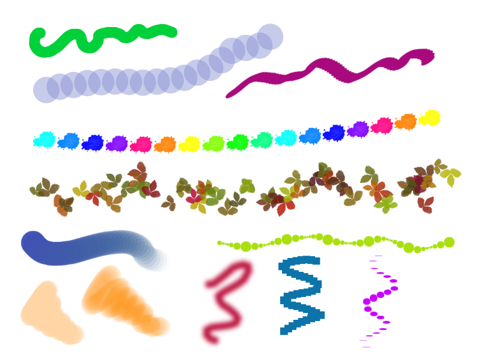
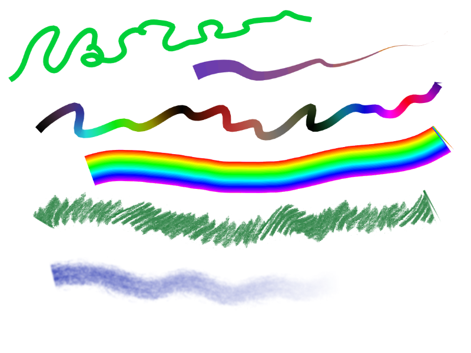

# SpruceBrush

This is a web application for drawing. It provides you some common features you 
can be familiar by desktop drawing apps, and various tool settings to play with.

## Running

Preview:
https://spruce-brush.netlify.app

For the better load speed download and open the dist folder at localhost.
The app saves the imported textures and patterns to local storage. So if you
would like to add a lot of new assets, there could be not enough place. In this
case, you may add it right to a corresponding folder: 
--src/assets/img/
---textures_brush/
---textures_roller/
---patterns/
Then run 
```
npm run import-assets
npm run build
```

## Features

### Tools
Currently there are available the following tools:
- Brush - draws points. 
- Roller - draws lines.
- Eraser
- Filling tool.
- Selection tool - move, rotate and the the part of the drawing
- Helpers tools: color picker, tool to drag and rotate the canvas.

This is not the most impressive list yet, but be sure there are a few more 
interesting things to be added ahead.

#### Tools settings
Basic settings for brush and roller: diameter or line width, opacity, blur. 
There are also the shape settings available for the brush: angle and stretch of 
a point, distance between points, point spread (perpendicular to the direction 
of the brush stroke).
For some settings, you can set the dynamics so that the parameter will change, 
for example, periodically or randomly. There is also support for tablet pressing
(if you choose "Pressure" dynamics).
You can choose a texture or even upload your own. The texture is used for alpha 
mapping, so it should be transparent.
It is also possible to draw with a gradient rather than a solid color.

Note: some settings has a parameter "length": it is set in units equal to diameter or
line width.

#### Some examples

Brush



Roller



### Top menu

Here you will find some useful functions:
**New drawing** 
**Change sizes**
Note that there are two options for what you can do with the existing content: 
move it relative to the canvas or resize it.
**Transform**
Rotate or mirror the image.
**Import**
Add image from file. There is three options, how you can adjust the sizes of 
the image imported and the canvas: 
1. Just place the image with original sizes at center
2. Resize the image so it fits the canvas.
3. Resize the canvas so it fits the image with original sizes.
You can also add images to the canvas by drag-in-drop, or paste from clipboard.
**Image filters**
**Save image to PNG**

### Color palette
You can create new palettes, add colors to it, reorder them by dragging. 
If you like the result, you can save you palette to json file, so you can load it 
after you cleared browser cache. Importing palettes is working not only with 
json of internal format, but also with raw text files: in this case the app
just tries to recogrize hex and rgba strings. I'll leave use cases for this 
functionality to your imagination.

### Layers
You can create, copy, reorder, merge layers, set the opacity and blend mode.
You can lock a layer (so you won't accidentally modify it), or lock a layer 
opacity (so you could draw only on non-trasparent parts, thus you get a simple mask).

### History
Currently, you can undo the last 10 actions.

## Useful shortcuts

### Common:
- Ctrl + N - new drawing
- Ctrl + S - save to file
- Ctrl + A - select a whole layer
- Ctrl + V - paste from clipboard
- Ctrl + Z - undo last action
- Ctrl + Y - redo last action
- Add - zoom in
- Minus - zoom out

### Selection:
- Ctrl + C - copy selection to clipboard
- Ctrl + X - cut selection to clipboard
- Ctrl + T - crop image to selected area
- Delete - clear selection

### Keys to select a centain tool:
-  B - Brush
-  E - Eraser
-  F - Fill
-  C - Color picker
-  S - rectangular Selection

### Keys to switch to a centain tool while pressing:
- Alt - color picker
- mouse middle button - hand

### Other keys on key press:
- Shift - restrict the moving to one axis
- Ctrl  - draw straight lines

### Other:
- Ctrl + W - fullview mode (hide side panels)
- Ctrl + E - merge a current layer with underlying one
- D - reset the main color to black and the background color to white


## Dependencies

This is a Vue.js project.
Vue components used:

**[vue-select](https://github.com/sagalbot/vue-select)**

**[vue-color-picker-wheel](https://github.com/stijlbreuk/vue-color-picker-wheel)**

**[Vue.Draggable](https://github.com/SortableJS/Vue.Draggable)**


## Known issues

 - An image looks blurry on zoom in. You can try to set resolution to x2 in settings, 
 but see if this wouldn't significantly slow down the app for you.

 
